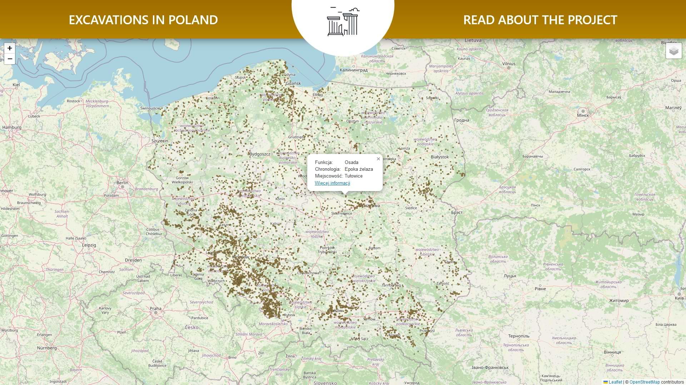

# Archaeological sites in Poland

    

[](https://github.com/f4rys/Archaeological-sites-in-Poland/actions/workflows/django.yml)

Interactive map of archaeological sites in Poland as provided by dane.gov.pl website. Markers are parsed via the WMS service. Information about every place is stored in the sqlite3 database and loaded upon click on a specific point. The application is hosted on PythonAnywhere.

<div align="center"></div>

## Data used
<div>• <a href="https://dane.gov.pl/pl/dataset/210,rejestr-zabytkow-archeologicznych">Archaeological sites in Poland provided via WMS service and CSV file</a></div>
<div>• <a href="https://creativecommons.org/licenses/by/4.0/legalcode.pl">Data from dane.gov.pl used under the CC BY 4.0 license</a></div>
<div>• Maps provided by OpenStreetMap and Esri</div>

## Libraries
<div>• <a href="https://www.djangoproject.com/">Django</a></div>
<div>• <a href="https://leafletjs.com/">Leaflet.js</a></div>
<div>• <a href="https://github.com/heigeo/leaflet.wms">Leaflet.wms.js</a></div>
<div>• <a href="https://github.com/leaflet-extras/leaflet-providers">Leaflet providers</a></div>
<div>• <a href="https://requirejs.org/">Require.js</a></div>
<div>• <a href="https://getbootstrap.com/">Bootstrap</a></div>

## Run locally

1. **Clone the Repository:**
   ```bash
   git clone https://github.com/f4rys/Archaeological-sites-in-Poland

2. **Create venv and activate it**
3. **Create a .env file in the base folder and fill it in:**
   ```bash
    SECRET_KEY={RANDOM_SECRET_KEY}
    DJANGO_SETTINGS_MODULE=archeological_sites_in_poland.dev_settings # For development
    # For production use: archeological_sites_in_poland.production_settings 
   ```

3. **Install dependencies and prepare database:**
   ```bash
   pip install -r requirements.txt
   python manage.py migrate
   python manage.py load_data
   ```
4. **Run the server and open it in the browser:**
   ```bash
   python manage.py runserver
   http://127.0.0.1:8000/
   ```

## Credits
<div>• Icon by <a href="https://www.iconfinder.com/icons/4791027/acropolis_ancient_building_greek_landmark_parthenon_icon">Royyan Wijaya</a> on Iconfinder</div>


